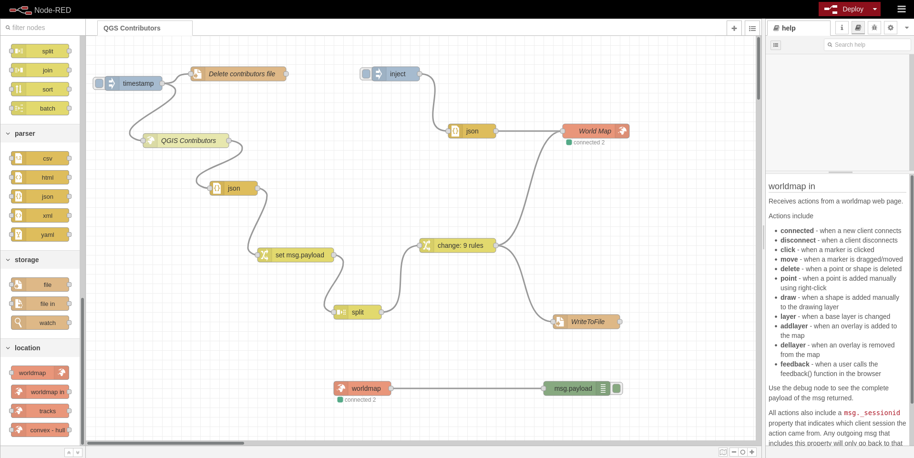
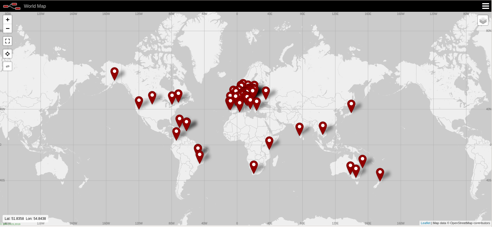

# QGIS Contributors

This [flow](qgis-contributors.json) will fetch the data from https://raw.githubusercontent.com/qgis/QGIS/master/resources/data/contributors.json

It demonstrates some JSON parsing, reconstructing the data into the simple, non geojson form used by https://flows.nodered.org/node/node-red-contrib-web-worldmap (note the worldmap does also support GeoJSON).

In my testing the map did not work properly in Firefox, works well in Chrome.

Map data is dynamically updated on the map as the flow runs.

There is also a demo showing how nodered can receive messages from the map.

Lastly it also writes the json snippets to a text file (which is not valid JSON).

One other gotcha: I tried to copy the lat and lon contents from the geometry but the change node would not get it out, so I opted to move it instead (see change node for details).





Snippet of what is written to file:

```
{"name":"Vincent Cloarec","lat":16.26555,"lon":-61.52506,"popped":true,"color":"#ff0000"}
{"name":"Belgacem Nedjima","lat":36.717145,"lon":3.154434,"popped":true,"color":"#ff0000"}
{"name":"Patrice Pineault","lat":45.40171,"lon":-71.88926,"popped":true,"color":"#ff0000"}
```
